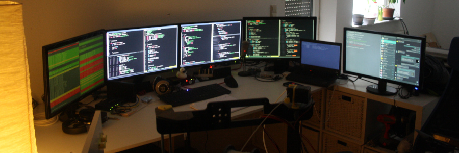

# System Dotfiles



Well, here we go again. I'm tired of unautomated shit, so this
is my repository where all the system profiles and their
configuration procedures are stored in.

I'm kind of an Arch Linux, Manjaro and GNOME fanboy, so you
gotta deal with it. All profiles here have the shared idea
of incrementally configuring stuff, so the setup procedures
can be used in partial, too.

Most likely there's `kitty` Terminal and `vim` installed
everywhere, as that's my preferred development environment.


## Profiles

**Intel NUC (nuccy)**

Profile: [./profiles/nuccy.sh](./profiles/nuccy.sh)

- Manjaro Linux and GNOME
- Monitor 1 (BenQ 24" HDMI 1920x1080)
- Monitor 2 (BenQ 24" DisplayPort 1920x1080)
- Monitor 3 (BenQ 24" DisplayPort 1920x1080)
- Intel HD4000
- Keyboard (Cherry KC1000 US Layout)
- Trackball (Kensington Orbit)

**Tower (weep)**

Profile: [./profiles/weep.sh](./profiles/weep.sh)

- Arch Linux and GNOME
- Synergy Server
- Monitor 1 (BenQ 24" HDMI 1920x1080)
- Monitor 2 (BenQ 24" HDMI 1920x1080)
- Monitor 3 (BenQ 24" HDMI 1920x1080)
- Radeon HD6000 and GTX 1080Ti
- Webcam (Logitech C920)
- Keyboard (Cherry KC1000 US Layout)
- Vertical Mouse (CSL 26069)
- Analog Audio Interface (Scarlet 2i2 USB) with Behringer C-3 microphone
- Analog Audio Headphones (AKG HD242)

**Thinkpad (tinky)**

Profile: [./profiles/tinky.sh](./profiles/tinky.sh)

- Arch Linux and GNOME
- Synergy Client (right of `weep`)
- Monitor 1 (Internal 1440x900)
- Monitor 2 (BenQ 24" HDMI 1920x1080)
- Monitor 3 (Acer 24" HDMI 1920x1080)
- Intel HD4000 and GT730M
- Germany Keyboard mapped as US Layout (in UEFI)


## Usage

The profiles are all available in [./profiles](./profiles).

If you want a custom username or email address, use the
optional export flow described here:

```bash
# Optionally set username and email
export USER="cookiengineer";
export EMAIL="cookiengineer@hahayougetspam.com";

# Look ma, no sudo!
bash ./profiles/nuccy.sh;
```

Afterwards, the `id_rsa.pub` file will be generated
if it doesn't exist - so it has to be added to the
GitHub account:

```bash
# Add this Public Key to GitHub
cat ~/.ssh/id_rsa.pub;
```

Also, VIM requires a manuall Install and Update:

```bash
vim;

# Execute :ZenInstall
# Execute :ZenUpdate
```


## Notes

The [./packages-aur](./packages-aur) folder contains a backup
of the equivalent packages on [AUR](https://aur.archlinux.org).


## Work in Progress

Remote server backups are a bit overcomplicated right now. So this
has still to be integrated nicely.

Example for backup scenario:

```bash
ssh root@git-mirror 'cd /; tar -cvpzf - --exclude=/lost+found --exclude=/dev --exclude=/mnt --exclude=/proc --exclude=/run --exclude=/sys --one-file-system /' > /home/cookiengineer/git-mirror-backup.tar.gz
```

